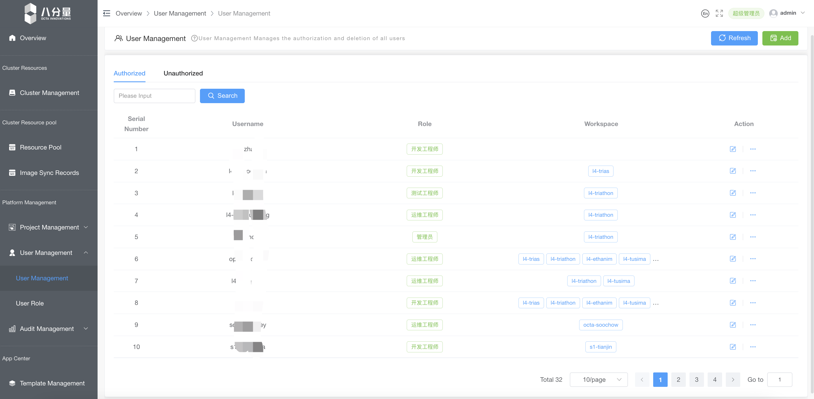

# 产品功能

 轻松使代码或应用，变为所见即所得服务状态，摒弃主机(服务器)概念  
 1. 明确项目base 镜像，协助coding生成镜像（同时可选择微服务化）  
 2. 推送镜像到管控仓库， 选择发布方向和资源（测试，灰度，线上）  
 3. 进行推送状态，跟进生成相关YAML，平台变更记录等  
 4. 同时即可看到资源所处的状态，以及相关的使用及访问量  

## 鉴权分组

平台中，资源（例如集群）可以在项目之间共享。超级管理员或项目管理员掌握不同的用户角色的权限设置。普通用户在环境空间对各种计算资源进行操作。基础设施层上的计算资源由 超级管理员 集中管理和分配，由于平台在项目命名空间层面实现了资源的隔离，因此用户不必担心计算资源分配额度以及资源竞争问题。其主要功能如下：  

- 角色身份： 内置多身份类型，平台内用户可按照角色进行授权；  
- 成员管理： 普通用户与项目(空间)，命名(空间) 进行关联，可为空间做精细化的成员管理  
- 项目管理：项目管理员可拥有多个不同的项目，对命名空间做相应管理；  

### 流程化实现

1.	一个workspace，即为一个组织的概念，用以建立应用或代码（func）与资源运行的动作
2.	每个组织，都是由oscro管控中心所（超管）创建，并赋予运行所需的计算资源上限，以及初始化对应的管控权限
3.	进入每个组织后，初始化的管理员，即可增加对应的人员，加入组织，成为应用流程中的一员，分配权限，划分应用（app）的操作域（namespaces）
4.	通过注册的用户，被加入到对应的组织后，通过赋予的权责，即可以建立和使用对应资源，并开创属于组织的应用（app）
5.	组织内通过的权限的辨识，即可参与到应用（app）项目的运行周期之中，行使自己的责权力，建立或处分当前应用的变更或业务状态的采集

## 资源管控

可以将任意的硬件资源，转化为可计价资产，让所有者提供给OSCRO平台中，通过相关的服务，提供给需要的用户的应用匹配使用，达到资源使用者和本地资源的拥有者各取所需，相互信任，互不影响

**平台提供了多维度的集群资源管理配置功能**： 

- 资源规划： 兼容 Kubernetes 集群资源合理分配规划，更好的提高集群资源使用率，降低IT成本；  
- 资源管理： 支持对项目名称空间内的资源进行扩容、监控等管理；  
- 细粒度资源控制： 基于 ResouceQuota 和 LimitRange 对用户环境空间内各应用进行细粒度资源的控制；    
- 灵活分配： 项目管理员可对不同项目不同命名空间进行动态资源划分；

### 资源整合实现
基础调度资，Basal layer（基础资源层），收集资源（权限、算力、存储），条带化处理，提供给调度者，通过规则去分配给对应的APP建立服务运行态，并返回对应的状态数据。
1.	通过oscro 中opt服务，将一组资源进行条带化处理，并对平台提供对应的操作api，及相关状态数据的提供
2.	这种opt服务的建立使用，变为通用的标准，即可使计算资源满足的情况下，成为资源的提供者
3.	资源加入也是要遵循，平台组织的管控要求，及使用时的分配条件
4.	平台对资源加入后，通过基础的服务，即可实现当前的数据流转和状态上报功能，对接应用后台的功能需求
5.	资源site 的使用，为了保证效率和业务使用效果，应用可以随意启动，但状态和数据的操作是不能跨越site的

## 应用管控

基于OSCRO基础服务，通过平台内的各接口，提供的状态，日志，业务数据的架构，以应用为核心角度，将数据整合后，进行语义分割并且关联后，形成对应的整体运行态和应用编排组织能力，利用审核对应的组织用户权限，来实现对应用的合理，便捷，安全，全面的掌控。

###	应用开发
开发人员可以自主创建容器快速进行运行服务代码，大大减少开发人员去申请资源成本，从此也规避了开发环境与生产环境基础服务或资源不符，产生的服务故障问题；
通过环境进行联调和协作，完成代码的快速迭代，应用转化，生成规范的上线应用，
 
###	应用变更

基于CRD插件服务方式实现让用户以灵活的自定义流水线以满足自身 CI/CD 需求；平台也提供了即用的流水线，填写相应的信息就可实现持续集成或持续部署。
 

###	状态管控

应用中心针对不同用户的需求，提供了可以应用模组管理自定义模组，开发或测试人员即拿即用，做到可快速部署启动应用；根据模组的创建应用编排，用户可在平台界面上，填写相应的信息就可以创建出自己的应用

 

