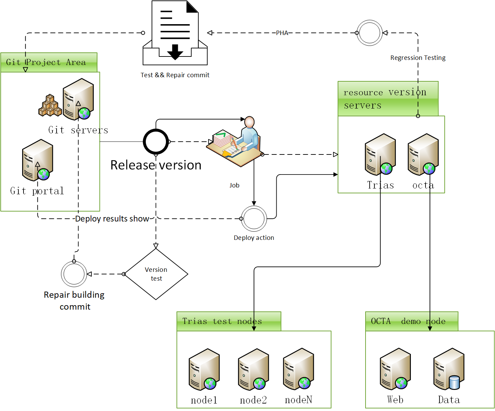
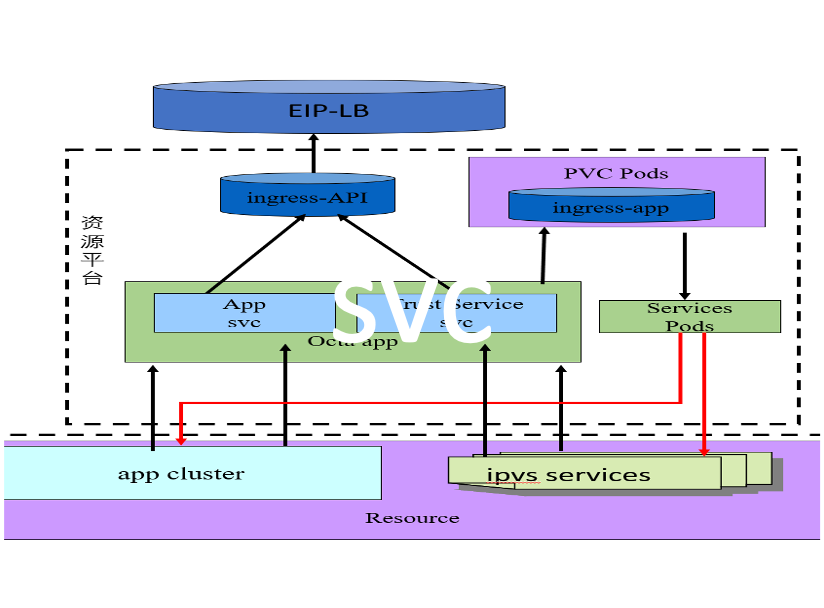
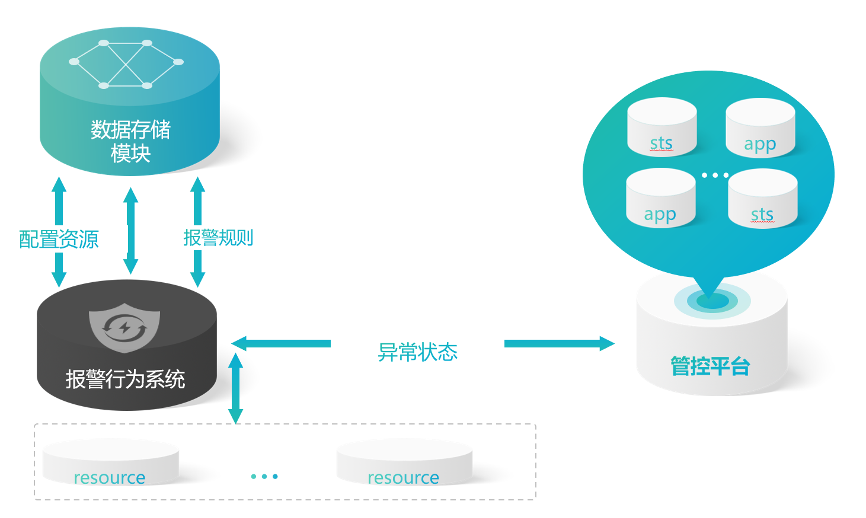

# 产品设计

## 	Lifecycle layer（执行调度层）

对接业务代码或者项目，通过规则生成对应的APP引擎，给调度层提供可运行的标准态服务，目前包含下面3组服务：  

1.	编排对接服务(orchestration) 
2.	构架对接服务(architecture) 
3.	抽象参数服务（argument) 

## Basal layer（基础资源层）

通过执行标准态的APP，明确权限责任，以及对应任务，引导到对应的资源群体中，具体人员进行直观可视化的操作入口。重点服务包括：  
1.	度量服务(measure)  
2.	调度服务(dispatch)  
3.	操作服务(operator)  

## Applications layer（应用代码层）

收集资源（权限、算力、存储），条带化处理，提供给调度者，通过规则去分配给对应的APP建立服务运行态，并返回对应的状态数据。重点包括：  
1.	管控基础（management ）  
2.	权限基础（authority）  
3.	集结基础（concentration）  

## 产品架构

系统由执行主控台，中间件调用模组，镜像组件模型，状态管控台，监控模组，报警中心，注册中心，调试日志模块组成。

### 主控服务端

为了满足构建服务 API，数据管理，任务触发等操作，管理异构和不同配置资源，便于 服务的运维管理，提供了集群管理的配置和管理功能，通过用户的使用空间，创建运行环境用于 服务的调度等行为。
 
资源的优选过程，为预选过程选择出的每个节点打分，主要基于Least Requested Priority和Balanced Resource Allocation两种原始的算法之上。

优化CPU和内存空闲比例状态的计算参数，使当前节点可以容纳更多服务 不会挤占资源占用率高的节点, 提高整个集群的资源利用率和可靠性, Ccpu和Cmem分别资源中的每节点总的CPU容量和内存容量，Rcpu代表资源点上已申请的计算容量和, Rmem代资源点上已申请的内存容量和，P为当前site中的资源分布节点的常数，改进的资源调度，更合理调度服务，提高当前节点的负载效率, 并加入流量的均衡效率参数计算L,S状态, 使负载均衡计算上加入网络利用率和流量的优化点。
最终得出的计算公式为:  

### 构建接入服务

目前持续集成由很多操作组成，比如抓取代码、运行测试、登录远程服务器，发布到第三方服务等等。为了更好的把代码转化为服务，就需要使用接入服务的模块。  

我们可以通过“事件”取得需要的执行的任务，然后自动下发和使用BUILD的定时任务，以及相关的基础配置和环境的匹配，自动化完成整个工作流程，自动转换为对应服务启动。

### 中间件实例
通过系统服务的基础模板，可以轻松快速进行实例的建立，且开发者可以使用系统天生规划的路径，通过名字解析的地址，还可以自主创建服务，建立中台服务模型，来处理相关的应用所需的逻辑，随时进行函数修改，链接池的创建，并且可以轻松配置应用所依赖的其他云设施，配合本地和远程调试，日志模组及集成部署。

### 服务负载系统
系统中一个应用服务会有一个或多个实例（资源可以通过rs进行多复本的建立）,每个实例或者应用的IP地址由网络插件动态随机分配（本地地址会改变）。为屏蔽这些后端实例的动态变化和对多实例的负载均衡，引入了SVC这个资源对象，根据创建的type类型不同，可分成多种模式，来满足不同的应用需求和服务的映射关系。

目前在各自的资源节点，使用了以iptables和ipvs实现对的Service的转发，负载均衡，为规避Iptables在进行规则查找匹配时的线性查找，后续引入IPVS的实现方式,其连接过程避免与集群Service的数量相关。进而达到集群内Service的增长，不会导致规则冗余效率降低的现象。

**特点**：  
1 将系统服务层完全独立，并将服务层抽取为一个个微服务  
2 微服务遵循单一原则  
3 微服务之间采用轻量级协议进行传输  
 
**优点**：  
1 服务拆分粒度更细，有利于资源重复利用，提高开发效率  
2 可以更加精准指定每个服务的优化方案，提高系统的可维护性  
3 微服务架构采用去中心化思想，服务之间采用轻量级协议通信，相比 ESB 更轻  
4 适合互联网产品，产品迭代更加快速和便捷  

### 状态监控服务

系统是一个跨平台的度量分析和可视化集合，通过将采集的数据查询然后可视化的展示。用来帮助用户，快速灵活的建立客户端图表，面板插件有许多不同方式的可视化指标和日志，平台库中具有丰富的仪表盘插件，比如热图、折线图、图表等多种展示方式；

支持多种接入的数据源，其中基本都可以系统平台中，指定创建和存储，通过添加一个使用配置文件和模板服务，主动供应系统来提供服务。运行更加自然，因为数据源和仪表板可以通过可以进行版本控制的文件来定义。所以我们还可以自己修改扩展这个系统，以便可以联动其他模块的服务，更好的配合应用的使用场景。

### 告警系统

目前报警系统，可以支持多种服务发现机制的数据匹配（File，static，Kubernetes，DNS，Consul, OpenStack,EC2等等）。基于服务发现的过程并不复杂，可以由服务或者通过第三方提供的接口，查询到需要监控的Target列表，然后轮训这些Target获取监控数据。  

系统中通过配置告警规则，如果规则成立，则发送一条消息给相关接收者，这里的接收者其实就是用户所属域，并可以配置多种告警方法如sms,  email， webhook等形式，下行消息。

### 日志调试系统

目前的实现体系，应用数据，通过队列获取到中台服务进行简单的分类，再通过事件转存到消息队列之中，还有部分性能或者业务打点数据直接转储到动态存储之中，再通过后端的日志模块去消费对应数据，到后端分析检索或展示系统。

目前取值除了部分系统性能外，类型分为：sysAudit mysqlAudit cmdLog idsLog trustLog sysLog，并已经集成了各插件实现了常用和重要的功能，（Marvel ，sense 等）已不再需要单独启动。

用户也可以按系统规范，启动自主相关的镜像服务，来完善和配合自己应用的使用场景，也可以满足定制相关需求，来做定制化的适配展示和排查需求。

### 插件和扩展

目前提供一套规范化模板，即可建立可独立完成某个或一系列功能的模型组件，即为当前的可扩展插件。它的运行基本不会影响系统原本的正常运行，在运行时被引入系统，由系统控制调度，可以同时存在多个插件和副本集，甚至可通过系统预定的方式进行组合。

经过长期的代码实践，已经可以总结出一套方法论来指导插件体系的实现，并且其中的一些实现的社区认可度比较高的模型，也可能被采取到基础服务模组类型之中。
