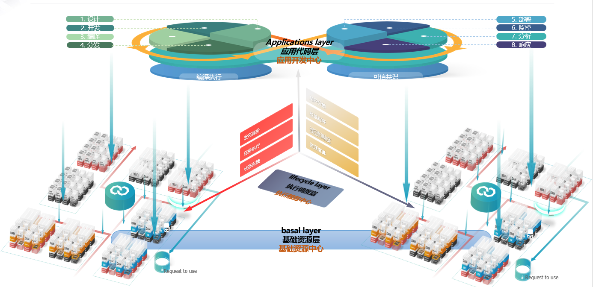

# 产品设计

## 	Lifecycle layer（执行调度层）

对接业务代码或者项目，通过规则生成对应的APP引擎，给调度层提供可运行的标准态服务，目前包含下面3组服务：  

1.	编排对接服务(orchestration) 
2.	构架对接服务(architecture) 
3.	抽象参数服务（argument) 

## Basal layer（基础资源层）

通过执行标准态的APP，明确权限责任，以及对应任务，引导到对应的资源群体中，具体人员进行直观可视化的操作入口。重点服务包括：  
1.	度量服务(measure)  
2.	调度服务(dispatch)  
3.	操作服务(operator)  

## Applications layer（应用代码层）

收集资源（权限、算力、存储），条带化处理，提供给调度者，通过规则去分配给对应的APP建立服务运行态，并返回对应的状态数据。重点包括：  
1.	管控基础（management ）  
2.	权限基础（authority）  
3.	集结基础（concentration）  

# 产品架构

系统由执行主控台，中间件调用模组，镜像组件模型，状态管控台，监控模组，报警中心，注册中心，调试日志模块组成。
