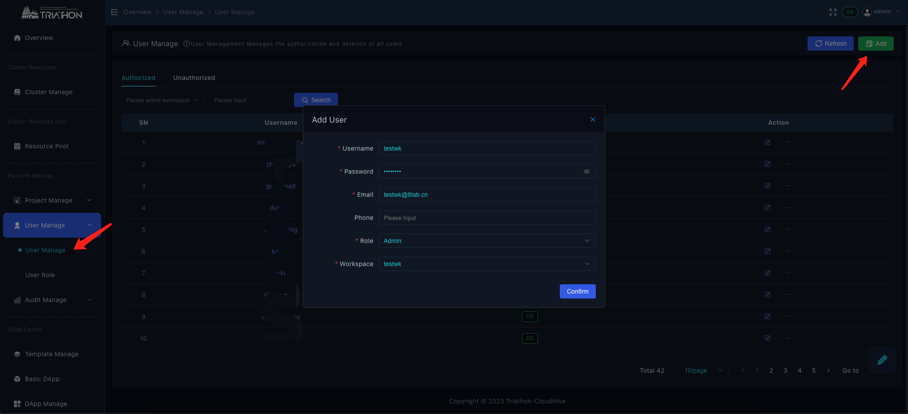
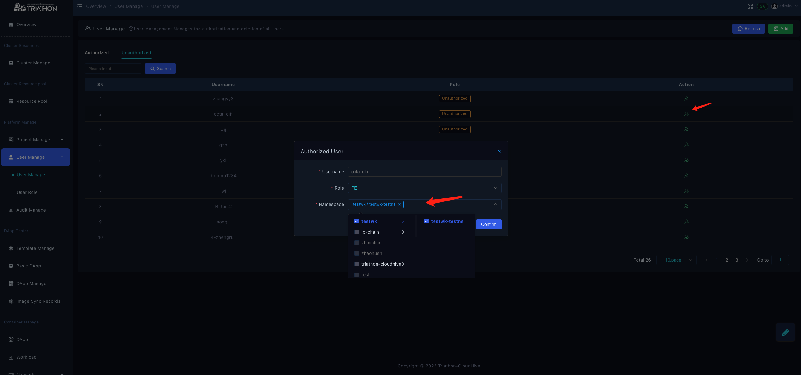

# 增加用户
新增用户的两种形式，可以由工作空间即项目管理人员增加，也可以让用户自己注册，由工作空间管理员去分配权限

## 管理员增加用户
由平台管理员增加用户，可增加任意工作空间下的任意角色用户
点击新增用户，*用户需要提供邮箱*

## 用户自己注册
点击注册用户，跳转到注册页面
 

输入注册信息，点击提交，在邮箱中获取验证码后，填入输入框，确认后,进入平台
 

## 授权用户
注册完成后的用户，为未授权用户，由admin 或者wkadmin 进行工作空间和名称空间的授权
选择需要授权的用户，点击action，授权角色和名称空间

