# 应用的使用

> 当dev scene做环境适配无误之后，服务将作为应用可长期运行在平台上

## 基础应用的新增
> *basic app* 作为应用的原始设置模版，可以用于去生成各个环境的运行应用配置。   
> *basic app* 可以在整个workspace的任何namespace 下去使用
### public Dapp
> public Dapp 为由平台提供的一系列基础的中间件，不断补充中  
> public Dapp 可以直接点击去生成应用在各自环境中去编辑，创建使用，也可复制到当前workspace下进行编辑保存为当前workspace下的basic Dapp

- 【Basic Dapp】 → 【Public Dapp】

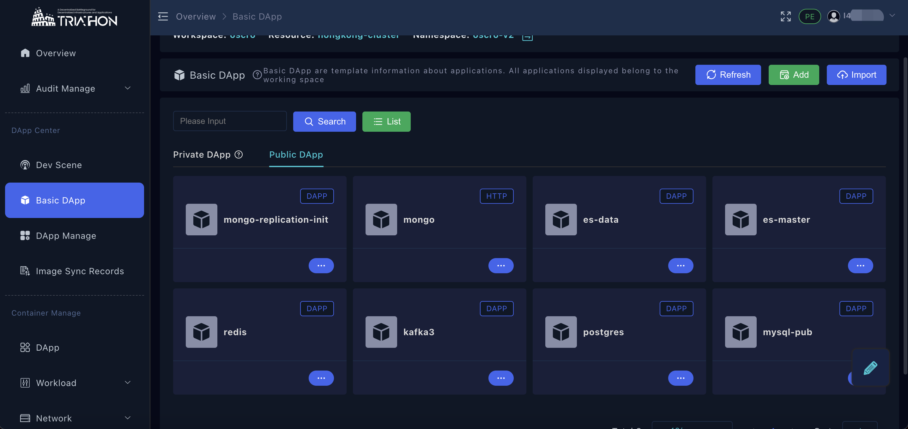

### basic Dapp

手动创建方式

- 【Basic Dapp】 → 【Add】,填写相关信息，点击【Submit】保存。 此时应用没有服务启动的任何编排文件。

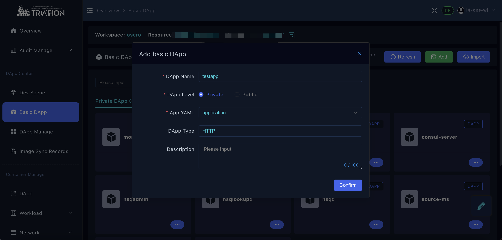

- 【Basic Dapp】 → testapp → 【...】→ 【View Components】 可查看当前basic dapp yaml list.

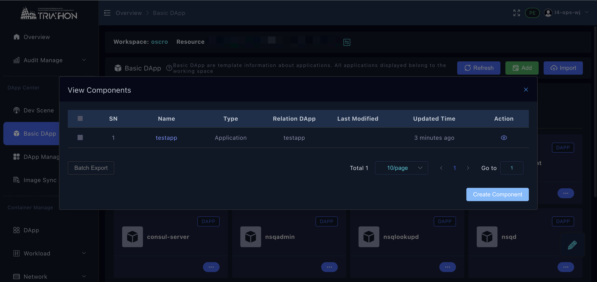

- 增加应用编排的yaml 组件，上面页面点击 【create component】

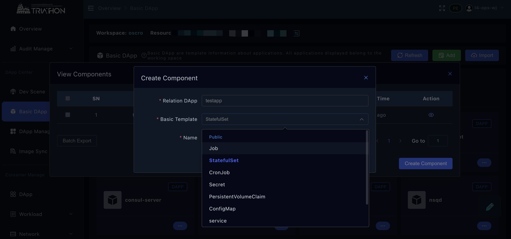

创建步骤详见[应用中心](../tutorials/应用中心.md) 基础应用

通过导入的方式，创建basic app

- 【Basic Dapp】 → 【Import】

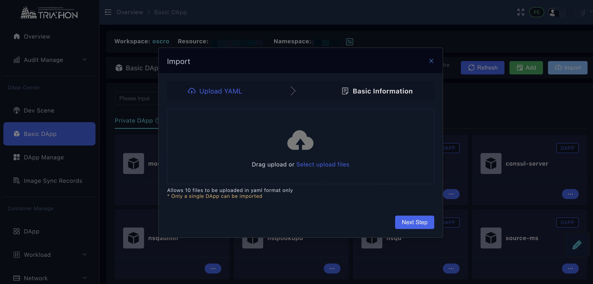

- 根据提示进行拖拽或者点击进行提示信息，通过筛选本地文件【Select upload files】，进行上传  
> *注意：*   
> - 仅支持文件上传，且必须包含application 所在的yaml文件  
> - 当前仅支持每次导入一个应用  

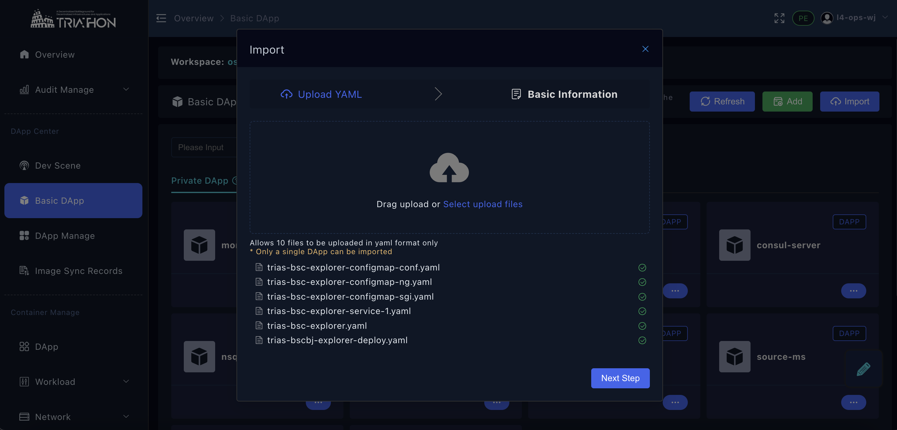

- 导入文件后，点击【Next Step】，

> 命名当前应用，选择【Private】level,根据应用类型选择Dapp type。

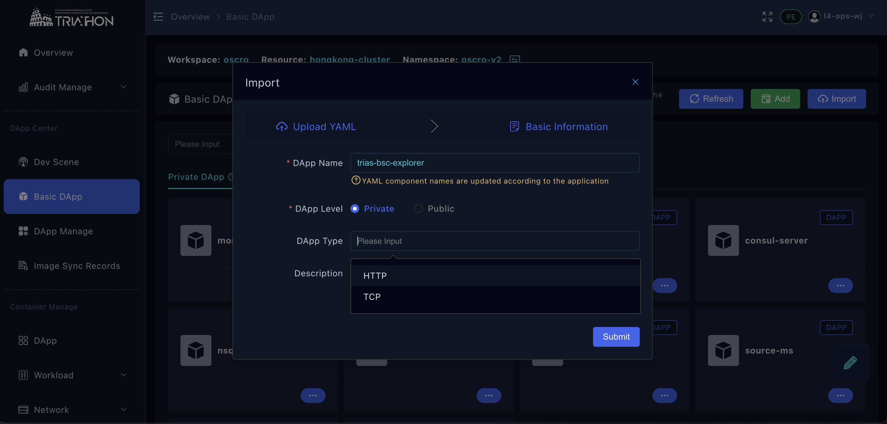

- 【submit】提交保存

## 应用的生成启动
> 根据每个环境中的资源状态，服务版本等，使用basic app 去生成匹配环境资源的服务启动编排

创建步骤详见[应用中心](../tutorials/应用中心.md) 去生成应用

## 应用的更新

- 查看应用list和拓扑 【Dapp】→ 【list】/ 【Graph】

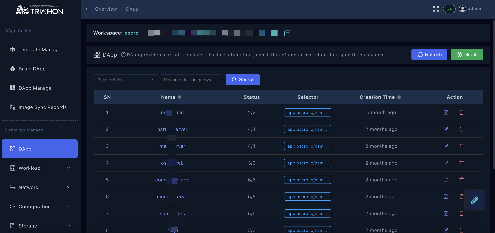

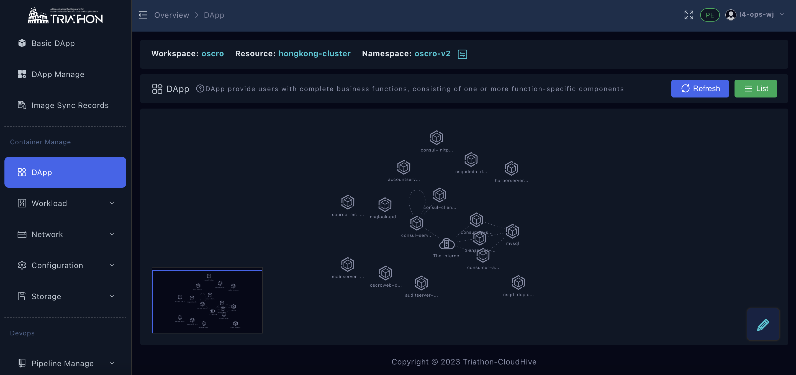

- 列表中模式下，点击应用名称进入详情，【Working component】→ 【action】→ 【create pipeline】

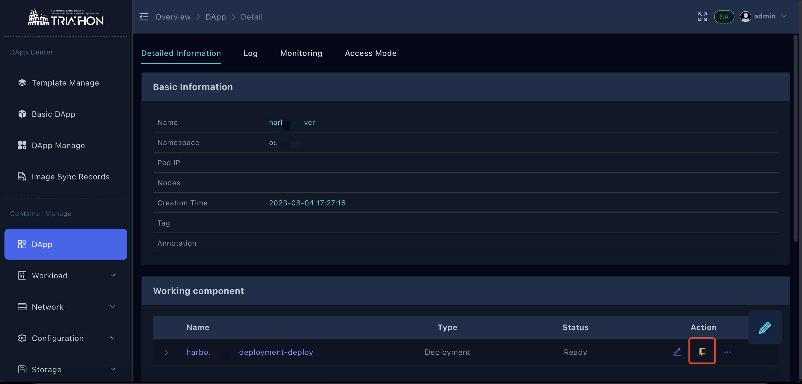

- 创建pipeline

创建步骤详见[应用变更管理](../tutorials/应用变更管理.md) 去生成应用

## 应用的发布上线

> 当应用测试完成准备上线时，可将镜像进行publish，平台将会发布当前运行着的应用的镜像，目前支持，单次一个镜像

- 【Dapp manager】→  Running 的 应用 → 【...】→ 【publish Image】

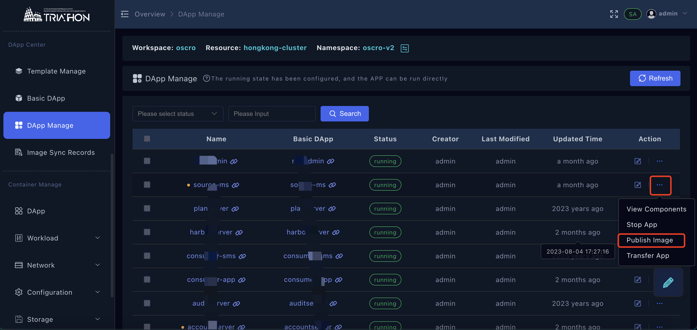

- 【Image Sync Records】查看镜像发布状态

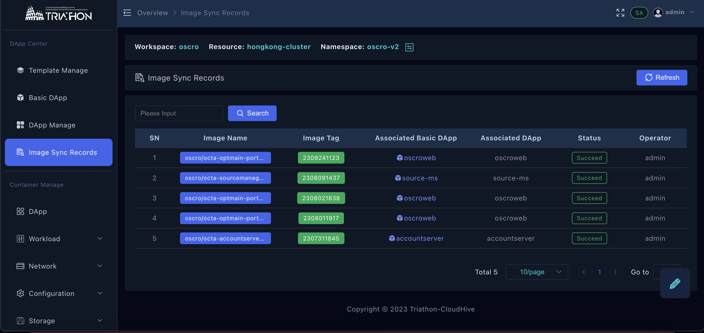

- 线上环境更新，编辑Dapp manage， 选择镜像时，选择public 下对应镜像版本选择保存

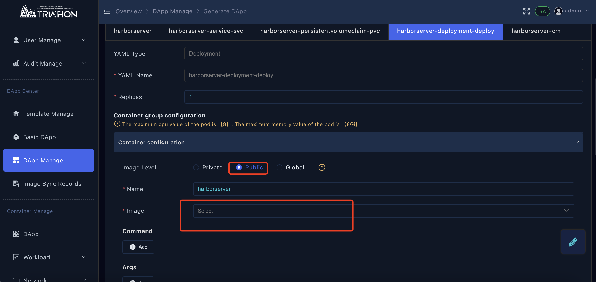

## 应用的启停
> 当前不支持直接应用更新，需要重新
- 停止应用： 【Dapp manage】→ running的应用 →【...】→  【Stop App】

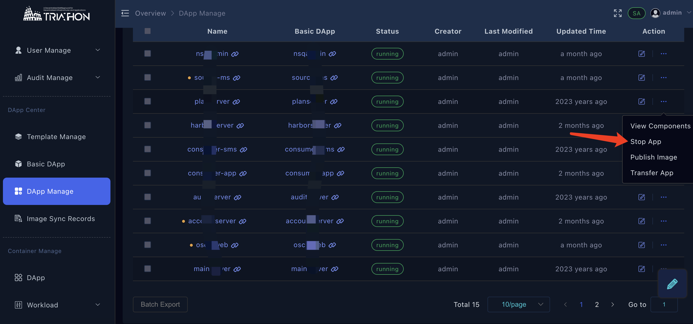

- 启动应用： 启动应用步骤与停止应用一样，stop 状态的应用点击【start App】

