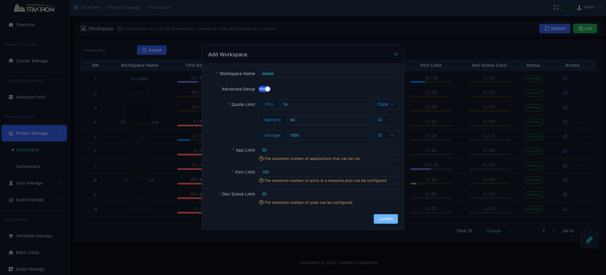

# 新增项目
以下内容由平台管理员权限操作，以下工作空间，简写为wk
## 增加项目wk
由平台管理员新增工作空间testwk

默认wk内资源上限

若有另外的需求，可以自定义设置工作空间上限

点击wk名称，或者右侧action 查看详情

## 设置wk管理员

参考[增加用户](./增加用户.md)，分配当前工作空间，设置权限为admin

## wk选择绑定资源
点击bind resources

选择resources 点击bing

设置绑定资源的大小

当绑定完需要修改时，按照上述步骤，编辑
## 创建名称空间namespace（ns）
进入namspace页，点击add 增加名称空间，按照需求，进行资源限制编辑

