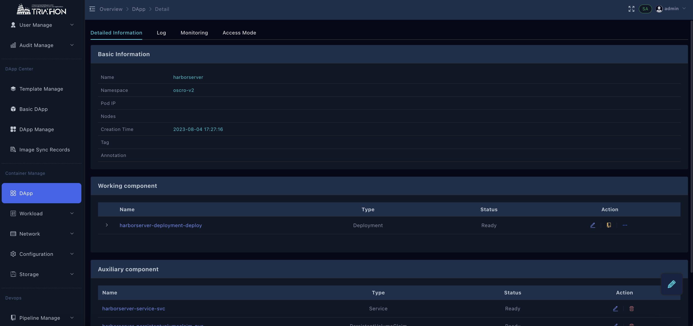
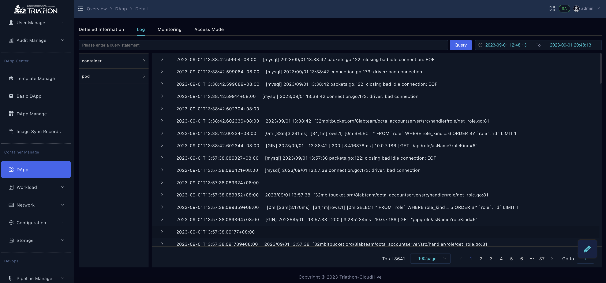
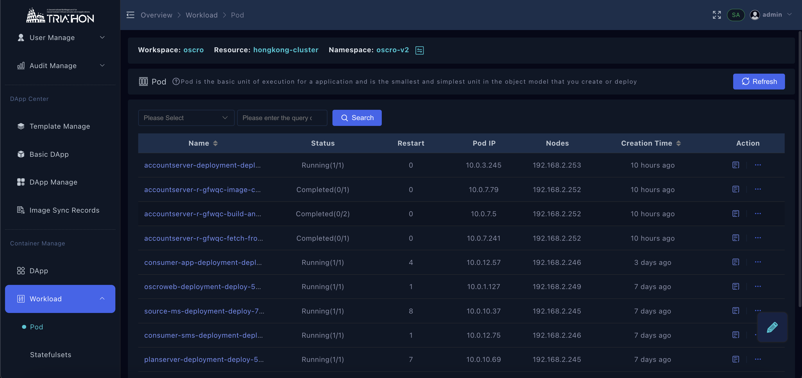
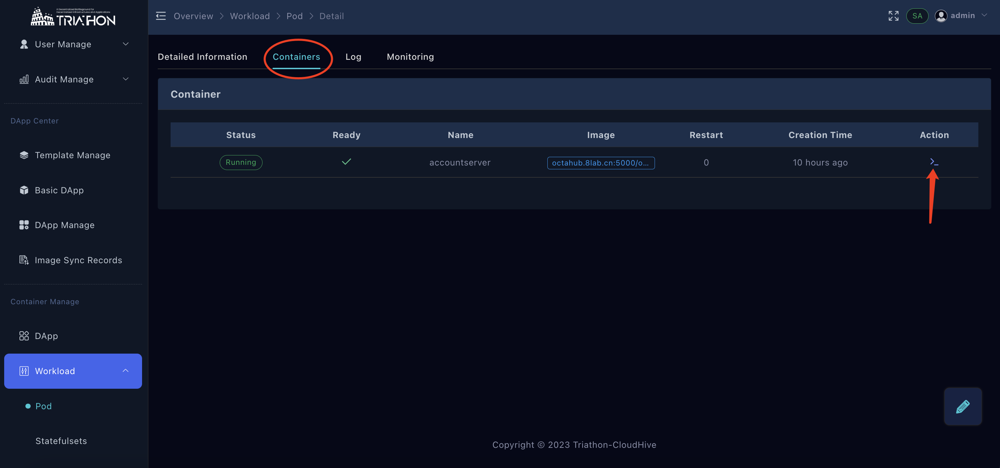

# 容器管理

## 工作负载

### 应用
- 在应用中心/应用管理处运行的应用可在此进行查看当前namespace 下应用拓扑， 点击右上角 [list]， 查看列表

- 点击应用名称，查看详情， 点击对应组件可跳转至各自的组件类型页面

- 查看应用日志

### 查看容器日志

- 容器管理进入【工作负载】→ 【容器组】 →  点击pod 进入详情

- 点击【log】按钮，弹出容器日志窗口,当有多个容器时，可按箭头指向，进行容器切换

### 进入容器终端

- 点击相应容器组进入 → 【Containers】→ 点击操作控制台按钮

### 查看容器监控

- 点击相应容器组进入 → 【monitoring】→ 点击操作控制台按钮

