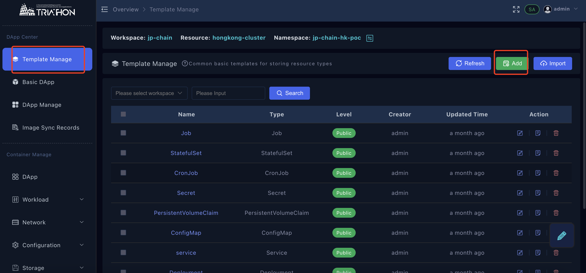
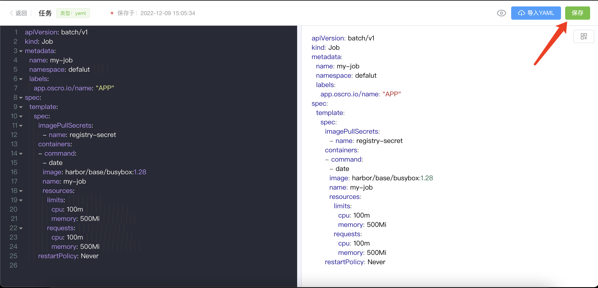
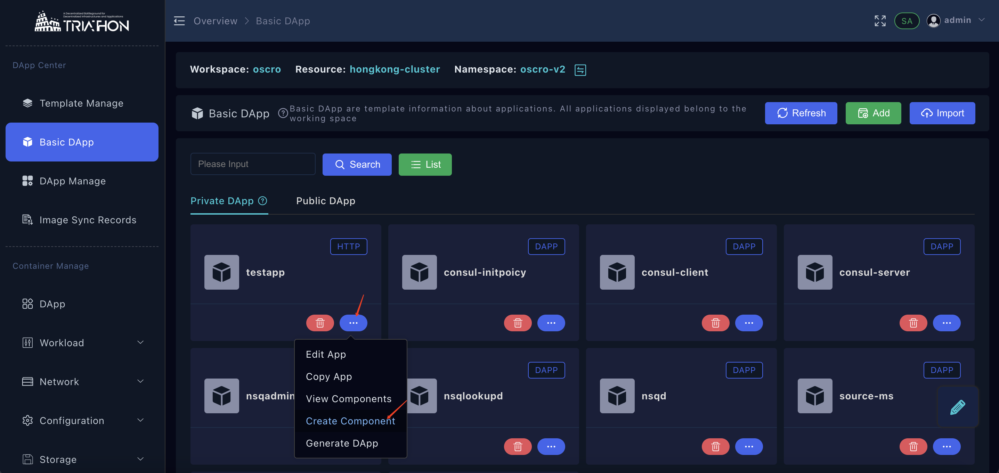
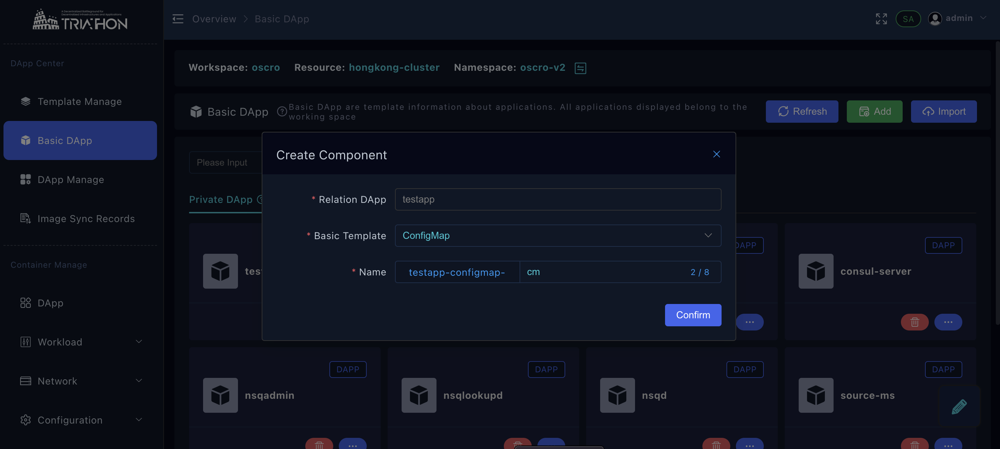
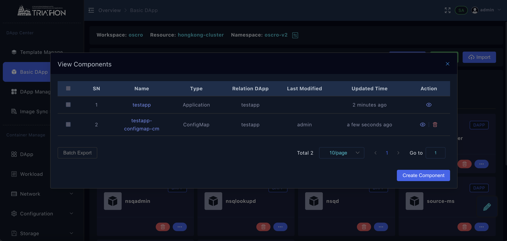
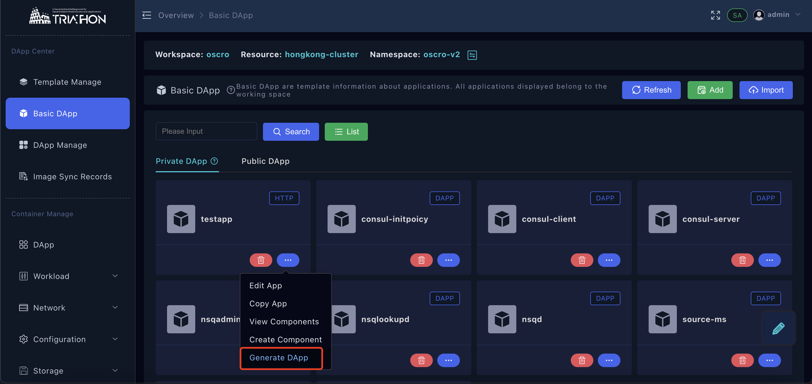
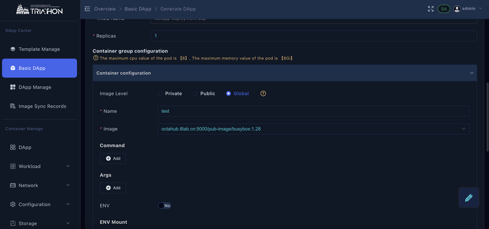

# 应用中心

## 应用模板

> 仅平台管理员可操作

- 使用admin账号登录OSCRO应用平台【模板管理】→ 【新增】

- 填写模板名称，对应容易管理处的服务资源进行添加，点击【确认】

- 编辑YAML

<!-- - 编辑YAML模板 → 【保存】

 -->

<!-- ## 应用模组 -->

## 基础应用
> 基础应用的作用： 编排应用配置

**创建基础应用**

- 应用中心 → 基础应用  → 点击【新增】按钮 

>工作空间管理员，普通用户创建的基础应用于工作空间下通用
>平台管理员创建的基础应用于所有工作空间皆可用

- 填写基础应用名称 → 点击【确认】按钮

**添加YAML**

- 点击操作••• → 创建组件

- 填写yaml名称 → 选择基础模板类型（无状态服务|服务|配置|存储...等） → 点击【确定】
> 基础模版主要为了提供常用字段提示，具体内容需创建的用户自己编辑

**自定义基础应用YAML**

- 点击操作••• → 查看YAML → 点击小眼睛查看yaml

<!-- - 点击编辑按钮，可进行配置编辑

- 编辑完成后点击保存， 点击返回

 -->

## 生成应用

**基于基础应用生成实际运行应用配置**
> 由基础应用添加对应名称空间的资源限制等配置

- 点击操作••• → 生成应用 → 点击运行态配置项【】→ 选择镜像、填写容器名称等、根据实际进行资源配额信息填写 → 点击【保存】

- 左侧栏点击应用管理查看当前存在应用，选择命名空间，点击操作••• → 运行应用 → 点击【确认】

