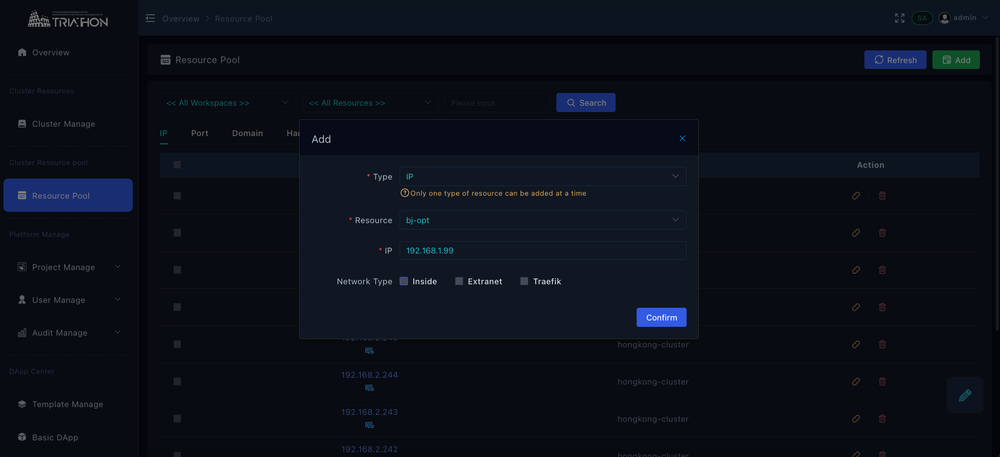

# 集群资源

**前置条件**

- kubeopt 服务集成资源状态运行成功

## **新增集群**

- 使用admin账号登录OSCRO应用平台，集群管理 → 点击【新增】按钮

- 填写资源名称：k8s-prod，主机域名：kubeopt对外服务地址端口 ，yaml：填写kubeconfig内容 ，点击【确定】

## 资源池管理

- 【资源池管理】→ 【新增】

- 选择工作空间、资源，对IP或端口类型进行管理

