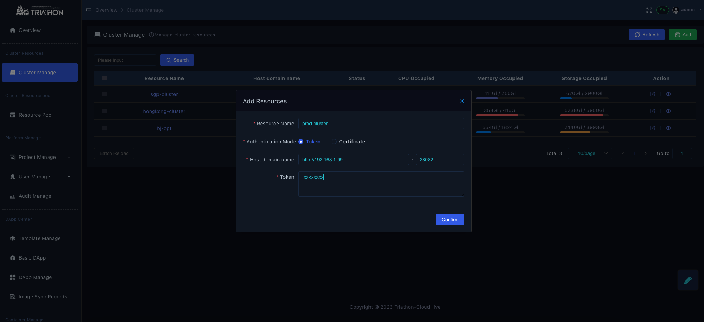

# 集群资源

**前置条件**

- kubeopt 服务集成资源状态运行成功

## **新增集群**

- 使用admin账号登录OSCRO应用平台，集群管理 → 点击【Add】按钮

- 填写资源名称：opt-prod，主机域名：kubeopt对外服务地址端口 ，选择认证模式Token，或者证书，进行信息添加，点击【Confirm】

## 资源池管理

### ip 增加及分配
- 【Resource Pool】→ 【Add】

- 选择【Type】 IP、对应【Resource】，进行地址增加  

  Network Type：   
  - Inside 表示对内地址  
  - Extranet 表示对外公网可访问地址  
  - Traefik 表示可以通过traefik 配置域名映射到的地址  

- 选择地址，分配给workspace  

**仅当workspace 已经绑定当点ip 所在resource后才可被分配使用该地址，每个地址仅可分配给一个workspace**

### 端口增加分配
选择工作空间、对应资源，对应IP地址进行端口分配

- 20080-20090：表示从20080 到20090 的端口
- 当有多个不连续端口时，可通过最下方Add 按钮进行增加

### domain 增加
**前提**： 当前worksapce 下已经分配过类型为traefik 的ip 地址，方可增加domain   

- 当已经申请好域名时，Nip 选择No,进行域名资源添加

切换http/ https 协议，当需要https 时，填写进入对应域名申请下来的证书

- 如遇临时测试，不需要申请域名，选择Nip yes 域名和证书需要自签后，按提示填入

### Harbor 增加

对应每个resource 会增加一个harbor ，选择增加harbor 类型，按提示填入信息

