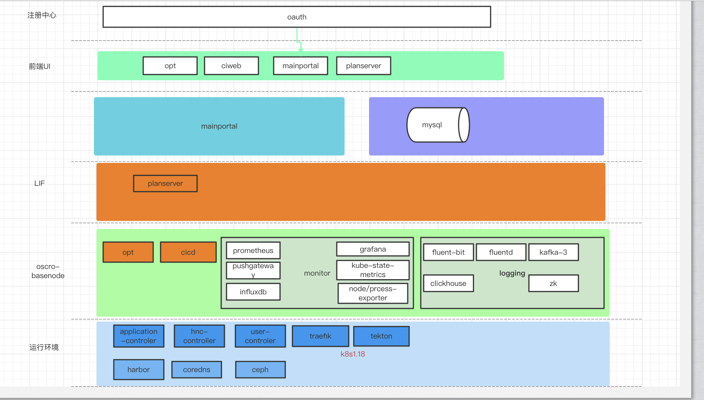

# 产品介绍

## 产品概述

**OSCRO**是一款以围绕serverless为核心通过自研和集成云原生而构建的通用性开源 PaaS 云管理平台。经过我们内部近一年的持续迭代，当前 **OSCRO** 的核心功能已经初步具备多项目场景下的统一管理。页面并集成了应用的快速创建及应用流水线。

作为一个serverless架构云平台，**OCSRO** 从立项开始就把以应用为中心场景下的多项目作为其主要实现设计目标。用户可以对接入平台的 Kubernetes 集群做自定义资源规划。除此之外，我们提供了比原生 Dashboard 功能更加丰富且人性化操作的 UI 界面，让用户/企业根据自身场景规划平台元数据，而不用担心自己的业务和数据出现错乱。同时OSCRO 也提供过了众多丰富的功能模块来为个人或企业用户带来更好的使用体验，例如 *访问控制、资源规划、网络隔离、容器管理、存储卷、监控系统、用户审计* 等功能。

## 产品架构

## 产品功能

### 集群管理与资源管理

云平台提供了多维度的集群资源管理配置功能：

- **资源超分：** 支持 Kubernetes 集群资源超分规划，更好的提高集群资源使用率，降低IT成本；
- **资源管理：** 支持对项目名称空间内的资源进行扩容、监控等管理；
- **细粒度资源控制：** 基于 ResouceQuota 和 LimitRange 对用户环境空间内各应用进行细粒度资源的控制；
- **灵活分配：** 项目管理员可对不同项目不同命名空间进行动态资源划分；

### 应用管理

应用中心针对不同用户的需求，提供了可以应用模组管理自定义模组，开发或测试人员即拿即用，做到可快速部署启动应用；根据模组的创建应用编排，用户可在平台界面上，填写相应的信息就可以创建出自己的应用；

**开发环境**

开发人员可以自主创建容器快速进行运行服务代码，大大减少开发人员去申请资源成本，从此也规避了开发环境与生产环境基础服务或资源不符，产生的服务故障问题；

### 容器管理

### 流水线管理

基于CRD方式实现让用户以灵活的自定义流水线以满足自身 CI/CD 需求；平台也提供了即用的流水线，填写相应的信息就可实现持续集成或持续部署。

- **可重复使用**：定义好的流水线，可直接用作流水线编排进行使用；
- **标准化**：完全基于kubernetes的安装与运行，所有的工作全部在kubernetes内部工作；
- **基于应用**：可基于现有的应用创建流水线，从而实现快速部署；

### 多项目管理

在 平台中，资源（例如集群）可以在项目之间共享。超级管理员或项目管理员掌握不同的用户角色的权限设置。普通用户在环境空间对各种计算资源进行操作。基础设施层上的计算资源由 **超级管理员** 集中管理和分配，由于平台在项目命名空间层面实现了资源的隔离，因此用户不必担心计算资源分配额度以及资源竞争问题。其主要功能如下：

- **角色身份：** 内置多身份类型，平台内用户可按照角色进行授权；
- **成员管理：** 普通用户与项目(空间)，命名(空间) 进行关联，可为空间做精细化的成员管理
- **项目管理**：项目管理员可拥有多个不同的项目，对命名空间做相应管理；
