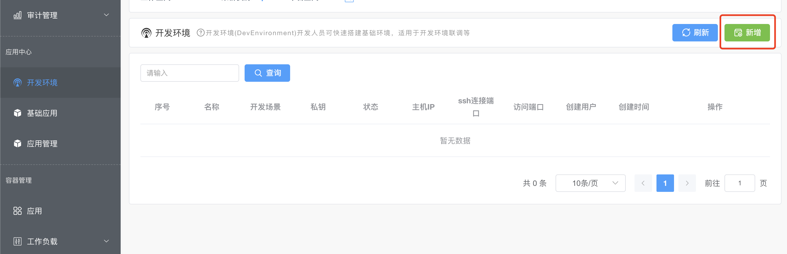
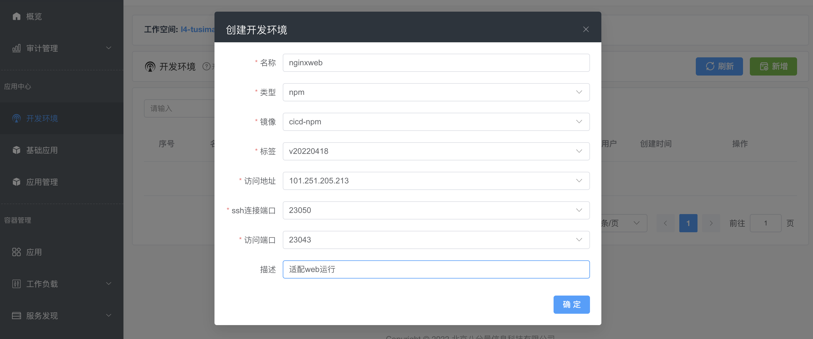
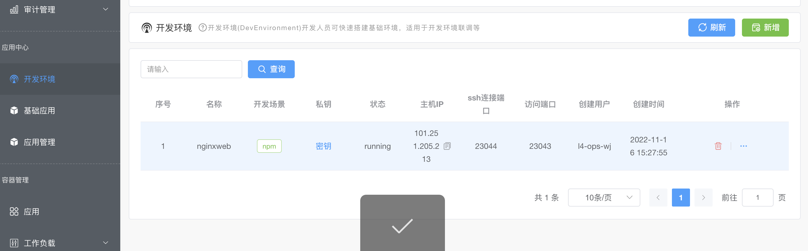
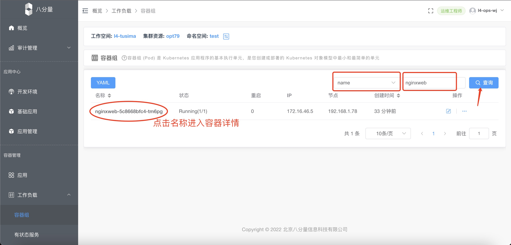
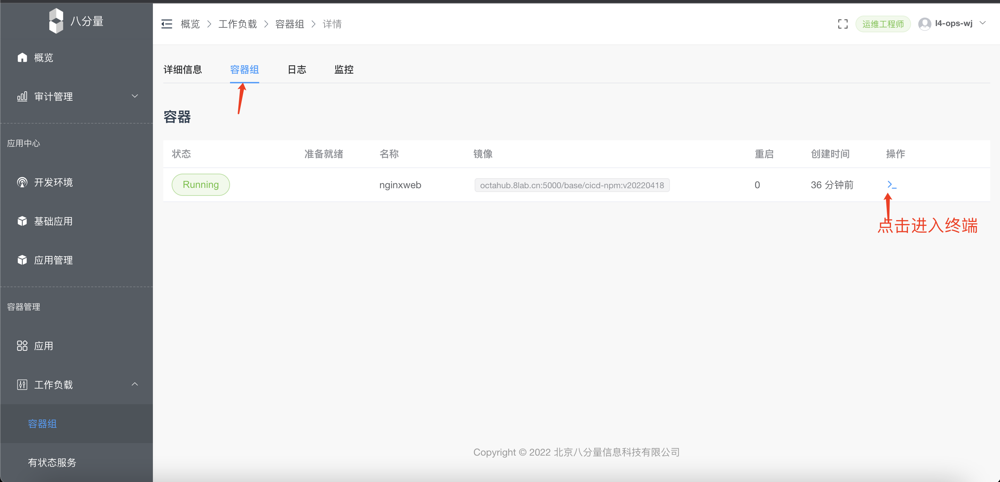
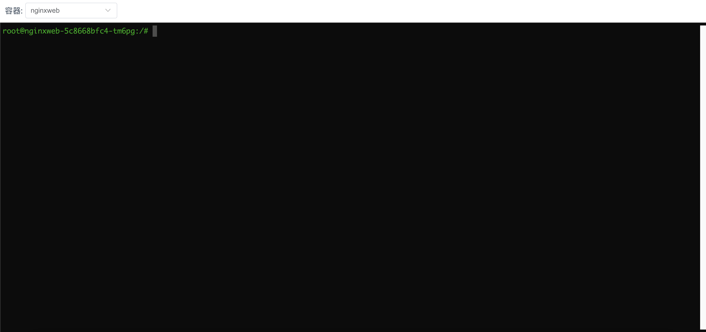

# 开发环境

## 创建开发适配环境
登陆开发工程师账号，创建开发环境，用以适配线上环境及中间件运行

- 【应用中心】→ 【开发环境】→ 【新增】


- 填写对应信息
```
名称： nignxweb                  #根据项目名称自定义名称
类型： npm                       #选择npm 类型开发环境
镜像： cicd-npm                  #选择平台提供的基础镜像
标签： v220220418                #选择镜像版本
访问地址： 101.251.205.213        #根据资源池地址选择
ssh连接端口： 23050               #根据资源池选择
访问端口： 23043                  #根据资源池选择，用于服务映射访问端口，容器内服务端口亦使用这个
描述： 适配web运行                 #自定义开发环境使用的信息记录
``` 



- 创建成功



## 进行开发使用
- 【容器管理】 → 【容器组】 → 【搜索】 nginxweb


- 进入详情中的容器诅，选择操作的容器，进入终端


- 弹出浏览器新标签页，进入终端


- 随后可类似使用服务器，进行服务的启动和安装

## 开发工具链接
